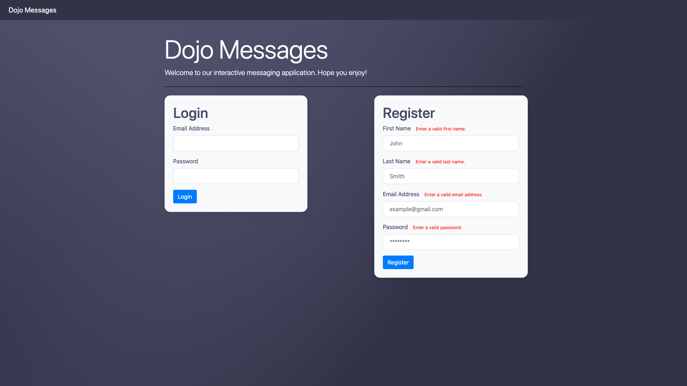
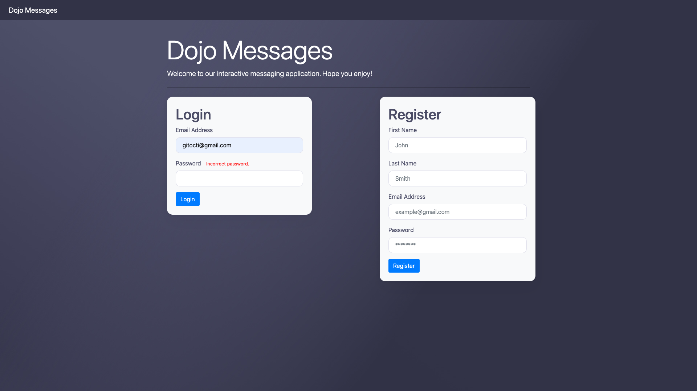
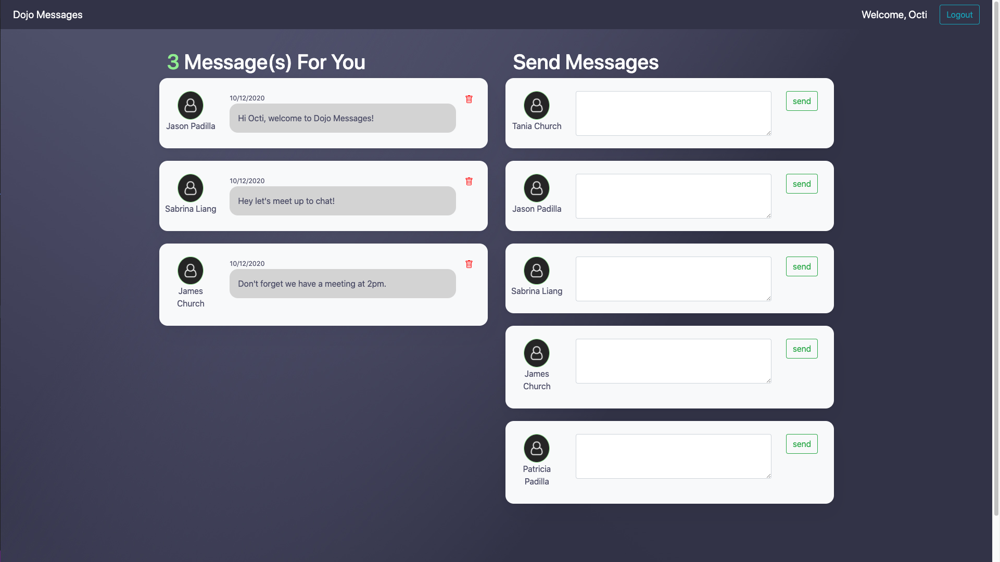

# DojoMessages
A webpage created with the Flask framework that allows users to send and receive messages from anyone who is signed up to the website. A user can register to create a new account or log in to an existing account. Before the user registers or logs in, the webpage checks to see if the user's inputs are valid and then checks to see if they match with what the database has. The website also uses AJAX to check in realtime if the email they are signing up with is available. Once the user has entered into an account they can view messages that they have from other users. They can then delete messages or send new messages without refreshing the page with the use of AJAX. 

# What I learned
* Practice Flask
* Bootstrap Styling
* Input Validations
* Flash Messages
* AJAX Callbacks
* SQL Queries
 
# Screenshots

